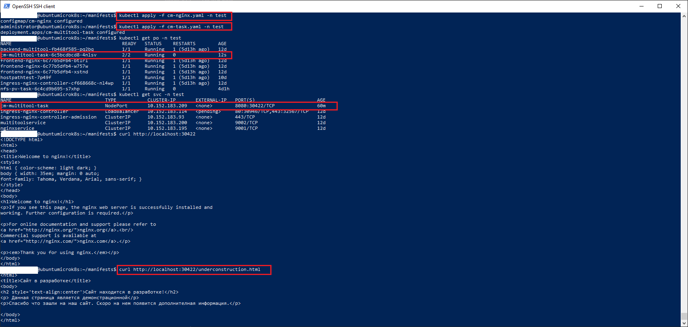
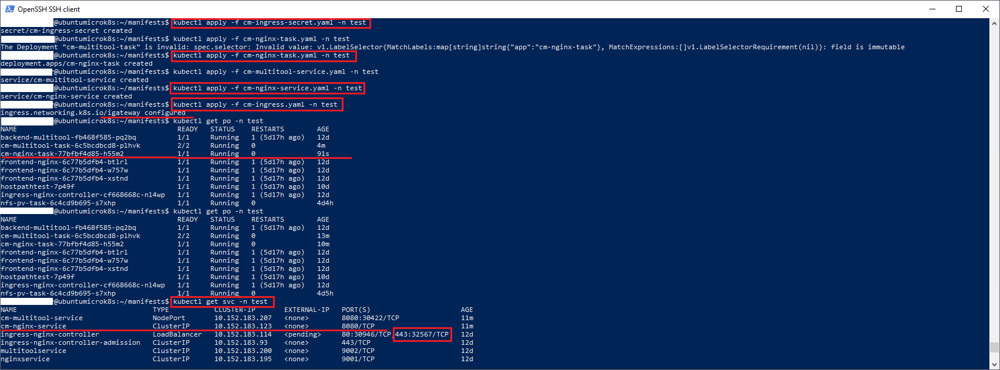
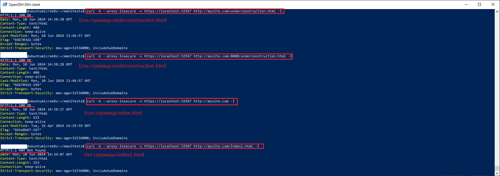

### Задание 1. Создать Deployment приложения и решить возникшую проблему с помощью ConfigMap. Добавить веб-страницу

1. Создать Deployment приложения, состоящего из контейнеров nginx и multitool.
2. Решить возникшую проблему с помощью ConfigMap.
3. Продемонстрировать, что pod стартовал и оба конейнера работают.
4. Сделать простую веб-страницу и подключить её к Nginx с помощью ConfigMap. Подключить Service и показать вывод curl или в браузере.
5. Предоставить манифесты, а также скриншоты или вывод необходимых команд.

### Решение 1

1. Манифесты  приложения и configmap:
  - Манифест приложения находится в [файле](manifests/cm-multitool-task.yaml)
  - Манифест конфига nginx находится в [файле](manifests/cm-nginx.yaml)
  - Манифест конфига multitool находится в [файле](manifests/cm-multitool.yaml)
  - Манифест сервиса расположен в [файле](manifests/cm-nginx-service.yaml) и получен командой:
  ```kubectl expose deploy cm-multitool-task -n test --port 8080 --target-port 8080 --type NodePort```
2. Страница *underconstruction.html* зашита в конфиг nginx. Результат развертывания манифестов и выполнения проверочной команды ```curl http://localhost:30422/underconstruction.html``` представлен на скриншоте ниже:
  


------

### Задание 2. Создать приложение с вашей веб-страницей, доступной по HTTPS 

1. Создать Deployment приложения, состоящего из Nginx.
2. Создать собственную веб-страницу и подключить её как ConfigMap к приложению.
3. Выпустить самоподписной сертификат SSL. Создать Secret для использования сертификата.
4. Создать Ingress и необходимый Service, подключить к нему SSL в вид. Продемонстировать доступ к приложению по HTTPS. 
4. Предоставить манифесты, а также скриншоты или вывод необходимых команд.

### Решение 2

1. Создаем манифесты приложения nginx, его сервиса и конфигурации:
  - Манифест приложения nginx со странице underconstruction.html находится в [файле](manifests/cm-nginx-task.yaml)
  - Манифест сервиса nginx находится в [файле](manifests/cm-nginx-service.yaml). Сервис необходим для организации пробрасывания трафика в ingress-контроллере, поэтому создаем сервис обязательно.  
  - Манифест конфигурации nginx-приложения находится в [файле](manifests/cm-nginx.yaml). Фактически он не поменялся по сравнению с манифестом из *Решение 1*
2. Создаем самоподписанный сертификат с OU=mycompany со сроком 1 год. Используем команду ниже, обязательно задает парольную фразу, имя организации(остальное можно не заполнять):
```openssl req -x509 -newkey rsa:4096 -keyout key.pem -out cert.pem -sha256 -days 365```
3. Создаем расшифрованный приватный pem-ключ:
```openssl rsa -in certs/key.pem -out certs/unencrypt_key.pem```
4. Создаем секрет типа tls на основе сертификата и расшифрованного файла приватного ключа:
```kubectl create secret tls cm-ingress-secret --cert=certs/cert.pem --key=certs/unencrypt_key.pem -n test```
5. Манифест сгенерированного секрета размещен в [файле](manifests/cm-ingress-secret.yaml)
  Процесс развертывания представлена на скриншоте ниже:
  `
6. Манифест ingress размещен в [файле](manifests/cm-ingress.yaml)
7. Тестируем с учетом следующих условий:
   - ingress выступает в качестве прокси применяем флаг *-x* с указанием адреса ingress-контроллера
   - используется самоподписанный сертификат соответственно  применяем флаг *--proxy-insecure*
   - любой запрос на ingress-контроллер машрутизируется на порт 8080 сервиса
   Итоговая команда проверки:
   ```curl -k --proxy-insecure -x https://localhost:32567 http://mysite.com/underconstruction.html -I```
  Ниже представлен скриншот проверки доступности страницы *underconstruction.html*
  

